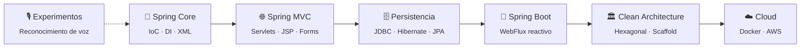
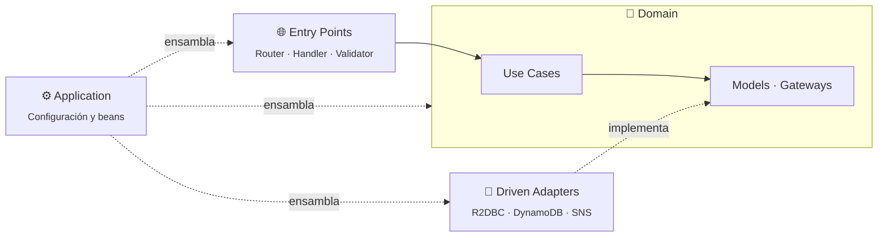

<div align="center">

# ☕ Java Playground

**Mi espacio para jugar, romper cosas y aprender Java.**

Del `Main.java` con XML de Spring clásico a microservicios reactivos con arquitectura hexagonal desplegados en AWS.


</div>

---

## 🧭 ¿Qué es esto?

Este repositorio no es un producto: es una **bitácora de aprendizaje**. Cada carpeta es un experimento, una práctica o un reto técnico que me sirvió para entender algo nuevo del ecosistema Java. Algunos proyectos son pequeños ejercicios de una sola clase; otros son APIs completas con pruebas, Docker e infraestructura como código.

La idea es simple: **probar, equivocarse, aprender y dejar registro.**

---

## 🗺️ El camino recorrido



---

## 📂 Estructura

```
development-java/
├── 🌱 spring/                 # Spring Framework "a la antigua" (Java 8, Maven, WAR)
├── 🚀 springboot/             # Spring Boot moderno (Java 21, Gradle, WebFlux)
└── 🎙️ ReconocimientoAudio/    # Reconocimiento de voz con CMU Sphinx
```

---

## 🌱 `spring/` — Los fundamentos

Proyectos con **Spring Framework 5.3**, **Java 8** y **Maven**, configurados con XML y desplegados como `.war`. Aquí está la base: cómo funciona Spring por dentro antes de que Spring Boot lo haga todo por ti.

| Proyecto | Qué aprendí | Tecnologías |
|---|---|---|
| [`RecordandoSpring`](spring/RecordandoSpring) | Inversión de control e inyección de dependencias, configuración XML vs. Java | Spring Context |
| [`Practica`](spring/Practica) | Primer controlador web y vistas JSP | Spring Context, Servlet, JSTL |
| [`Practica2`](spring/Practica2) | Spring MVC con `DispatcherServlet` | Spring WebMVC, JSTL |
| [`Practica3`](spring/Practica3) | Separación interfaz / implementación en controladores | Spring WebMVC |
| [`Practica4`](spring/Practica4) | Capas controller → service → model, formularios y pruebas | Spring WebMVC, Hibernate, MapStruct, PostgreSQL, JUnit |
| [`FirstMVCVid28`](spring/FirstMVCVid28) | Ejercicio de curso: primera app MVC | Spring Context, JSP |
| [`SpringMVCForms`](spring/SpringMVCForms) | Formularios, DTOs y validaciones personalizadas | Spring WebMVC, Hibernate Validator |
| [`CRUD`](spring/CRUD) | Patrón DAO y CRUD con JPA | Hibernate 6, MariaDB |
| [`PildorasCRUD`](spring/PildorasCRUD) | CRUD con clases base genéricas (controller, service, repository) | Spring WebMVC, PostgreSQL, Gson |

---

## 🚀 `springboot/` — Microservicios modernos

APIs **reactivas** con **Spring Boot 4**, **Java 21**, **Gradle** y **arquitectura hexagonal** generada con el [Scaffold Clean Architecture de Bancolombia](https://github.com/bancolombia/scaffold-clean-architecture). Cada uno tiene su propio README con el detalle.

| Proyecto | Descripción | Destacados |
|---|---|---|
| [💳 `tarjetas`](springboot/tarjetas) | Administración de tarjetas de crédito y transacciones de compra | R2DBC + PostgreSQL, frontend en **Angular 21** |
| [🏪 `franchise`](springboot/franchise) | Gestión de franquicias, sucursales y su stock de productos | R2DBC + PostgreSQL, Docker |
| [📦 `products`](springboot/products) | Dos microservicios desacoplados: **productos** e **inventario** | API Key, rate limiting, correlation ID, Flyway, Resilience4j |
| [💰 `funds_ceiba`](springboot/funds_ceiba) | Suscripción y cancelación de fondos de inversión con notificaciones | **DynamoDB**, **SNS** (email/SMS), CloudFormation, ECS Fargate |

### 🏛️ La arquitectura que se repite



El **dominio** no conoce a nadie; la infraestructura depende de él y no al revés. Cambiar PostgreSQL por DynamoDB es cuestión de escribir otro adaptador.

---

## 🎙️ `ReconocimientoAudio/` — Experimento de voz

Un *Hello World* de reconocimiento de voz con **[CMU Sphinx](https://cmusphinx.github.io/)**: escucha el micrófono y reconoce frases definidas en una gramática (`hello.gram`). Un desvío divertido para ver qué más se puede hacer con Java.

---

## ▶️ Cómo correr los proyectos

<details>
<summary><b>🌱 Proyectos Spring (Maven)</b></summary>

```bash
cd spring/<proyecto>
mvn clean package
# Despliega target/<proyecto>.war en Tomcat
```

</details>

<details>
<summary><b>🚀 Proyectos Spring Boot (Gradle)</b></summary>

```bash
cd springboot/<proyecto>
export DB_PASSWORD=...   # y demás variables que indique su README
./gradlew bootRun
```

Para las pruebas:

```bash
./gradlew test
```

</details>

<details>
<summary><b>💳 Frontend de tarjetas (Angular)</b></summary>

```bash
cd springboot/tarjetas/frontend
npm install
npm start   # http://localhost:4200
```

</details>

---

## 📝 Notas

- Las credenciales que aparecen en los proyectos son **valores de desarrollo local** (`localhost`). Las contraseñas reales se pasan por variables de entorno.
- Algunos proyectos antiguos se crearon con Eclipse/STS; la configuración del IDE no se versiona, pero todos se pueden importar desde su `pom.xml` o `build.gradle`.

<div align="center">

---

Hecho con ☕ y mucha curiosidad por **[Andrés Sierra](https://github.com/andysierra)**

</div>
