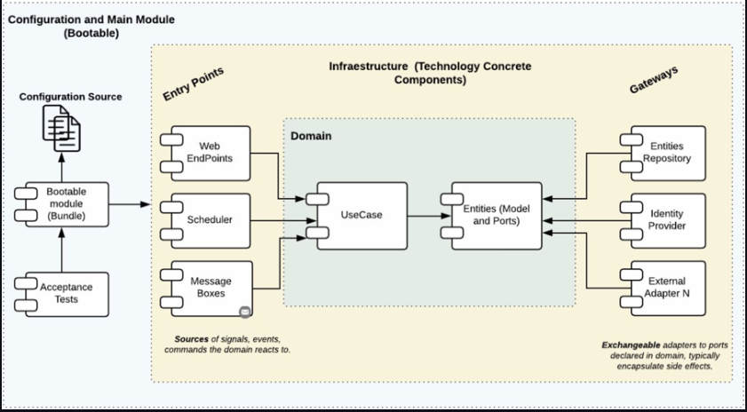
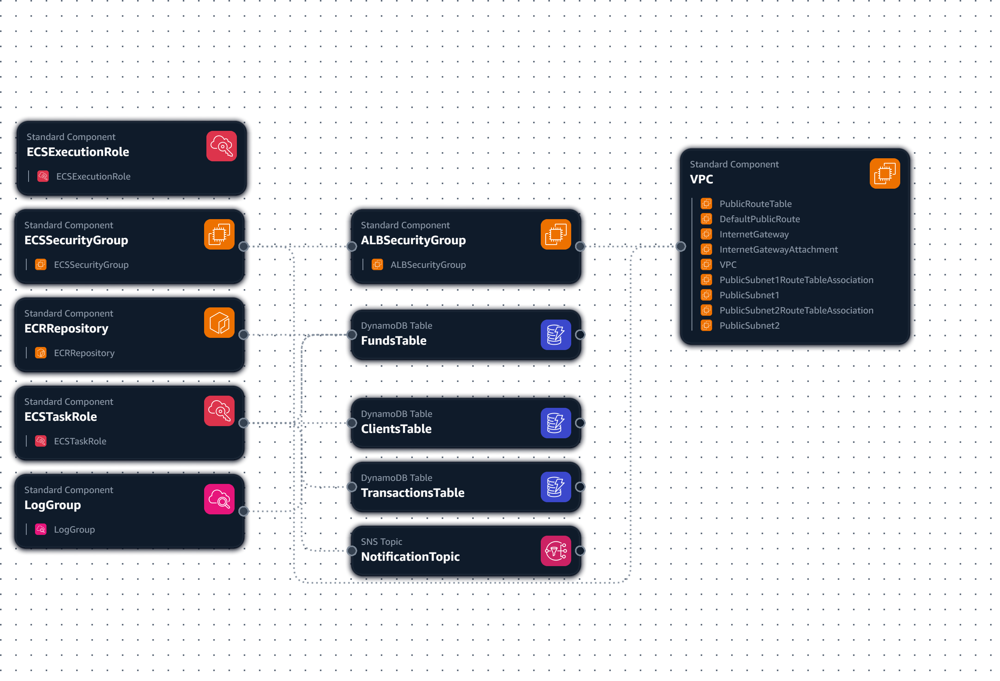
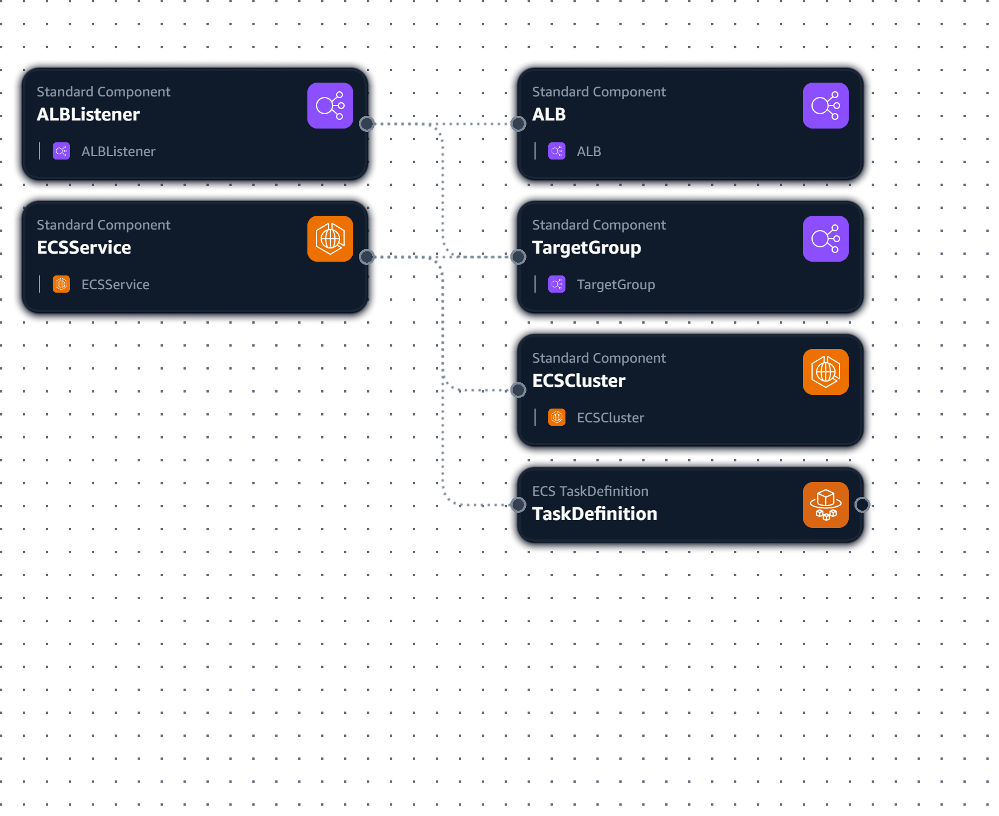
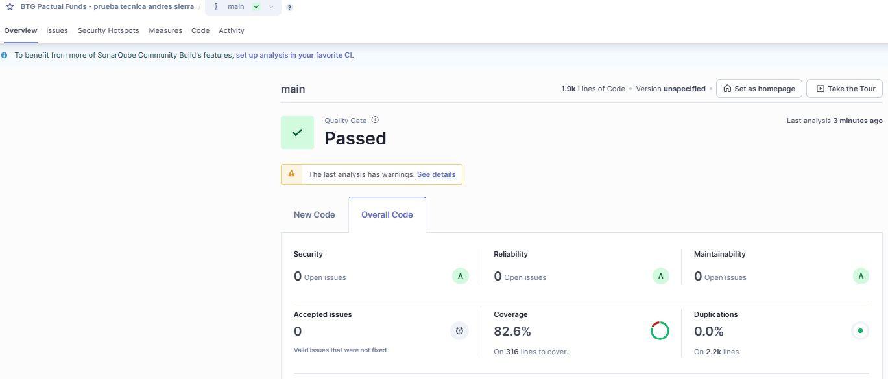

# BTG Pactual - Gestion de Fondos de Inversion

API REST reactiva para gestion de fondos de inversion. Permite a los clientes suscribirse/cancelar fondos, consultar historial de transacciones y recibir notificaciones por email o SMS.

## Stack Tecnologico

- **Java 21**
- **Spring Boot 4.0.3** (WebFlux - Reactivo)
- **Gradle 8.14**
- **Scaffold** Clean Architecture Plugin v4.2.0
- **DynamoDB** Enhanced Client (AWS SDK v2.31.8)
- **SNS** para notificaciones (email/SMS)
- **Jakarta Bean Validation**
- **JUnit 5 + Mockito + StepVerifier**
- **AWS CloudFormation** (ECS Fargate + ALB)

## Arquitectura Hexagonal



```
                    +--------------------------------------+
                    |           APPLICATION                 |
                    |  (Ensamblaje, configuracion, beans)   |
                    +-----------------+--------------------+
                                      |
          +---------------------------+---------------------------+
          |                           |                           |
 +--------v---------+   +------------v-----------+   +-----------v----------+
 |   ENTRY POINTS   |   |        DOMAIN          |   |   DRIVEN ADAPTERS    |
 |  (reactive-web)  |   |                        |   |                      |
 |                   |   |  +------------------+  |   |  (dynamo-db)         |
 |  Handler          |-->|  |    Use Cases     |  |<--|  ClientRepoAdapter   |
 |  RouterRest       |   |  |                  |  |   |  FundRepoAdapter     |
 |  ResponseBuilder  |   |  +--------+---------+  |   |  TransactionAdapter  |
 |  RestValidator    |   |           |             |   |                      |
 |  Mapper           |   |  +--------v---------+  |   |  (sns)               |
 |                   |   |  |  Models/Gateways |  |   |  SnsNotification     |
 |  Requests/        |   |  |  Enums/Errors    |  |   |    Adapter           |
 |  Responses        |   |  +------------------+  |   |                      |
 +-------------------+   +------------------------+   +----------------------+
```

### Capas

**Domain (Model):** Modelos de negocio (`Client`, `Fund`, `Transaction`), enums (`TransactionTypeEnum`, `NotificationPreferenceEnum`, `FundCategoryEnum`), interfaces de repositorio (Gateways), excepciones (`BusinessException`, `OptimisticLockException`) y mensajes (`MessagesEnum`).

**Domain (Use Cases):** Logica de negocio pura con proteccion contra concurrencia:
- `SubscribeToFundUseCase` - Valida cliente, fondo, saldo, suscripcion existente, preferencia de notificacion. Retry automatico ante conflictos de concurrencia.
- `CancelSubscriptionUseCase` - Valida suscripcion activa, reintegra saldo. Retry automatico ante conflictos de concurrencia.
- `GetTransactionHistoryUseCase` - Historial por cliente
- `GetFundsUseCase` - Catalogo de fondos

**Entry Points (reactive-web):** Routing funcional WebFlux. `Handler` orquesta, `RestValidator` valida DTOs, `Mapper` convierte entre capas.

**Driven Adapters (dynamo-db):** Implementacion de gateways con DynamoDB Enhanced Client. GSIs para consultas por `clientId` y `clientId#fundId`. Optimistic locking con versionamiento en operaciones de escritura sobre clientes.

**Driven Adapters (sns):** Notificaciones via Amazon SNS topic.

## Modelo de Datos NoSQL (DynamoDB)

### Tabla: dev-btg-clients
| Campo | Tipo | Clave |
|-------|------|-------|
| id | String | PK |
| name | String | |
| email | String | |
| phone | String | |
| balance | Number | |
| notificationPreference | String | |
| version | Number | Optimistic Lock |

### Tabla: dev-btg-funds
| Campo | Tipo | Clave |
|-------|------|-------|
| id | Number | PK |
| name | String | |
| minimumAmount | Number | |
| category | String | |

### Tabla: dev-btg-transactions
| Campo | Tipo | Clave |
|-------|------|-------|
| id | String | PK |
| clientId | String | GSI (clientId-index) |
| clientIdFundId | String | GSI (clientIdFundId-index) |
| fundId | Number | |
| fundName | String | |
| type | String | |
| amount | Number | |
| createdAt | String | |

### Fondos disponibles

| ID | Nombre | Monto minimo | Categoria |
|----|--------|-------------|-----------|
| 1 | FPV_BTG_PACTUAL_RECAUDADORA | COP $75.000 | FPV |
| 2 | FPV_BTG_PACTUAL_ECOPETROL | COP $125.000 | FPV |
| 3 | DEUDAPRIVADA | COP $50.000 | FIC |
| 4 | FDO-ACCIONES | COP $250.000 | FIC |
| 5 | FPV_BTG_PACTUAL_DINAMICA | COP $100.000 | FPV |

## Variables de Entorno

```
AWS_REGION=us-east-1
DYNAMODB_TABLE_CLIENTS=dev-btg-clients
DYNAMODB_TABLE_FUNDS=dev-btg-funds
DYNAMODB_TABLE_TRANSACTIONS=dev-btg-transactions
SNS_TOPIC_ARN=arn:aws:sns:us-east-1:247992390076:dev-btg-notifications
```

## Ejecucion Local

```bash
# Build
./gradlew clean build

# Ejecutar
./gradlew bootRun
```

Requiere credenciales AWS configuradas (`~/.aws/credentials`) con acceso a DynamoDB y SNS.

## Seed Data (AWS CLI)

### Catalogo de fondos
```bash
aws dynamodb put-item --table-name dev-btg-funds --item '{"id":{"N":"1"},"name":{"S":"FPV_BTG_PACTUAL_RECAUDADORA"},"minimumAmount":{"N":"75000"},"category":{"S":"FPV"}}'
aws dynamodb put-item --table-name dev-btg-funds --item '{"id":{"N":"2"},"name":{"S":"FPV_BTG_PACTUAL_ECOPETROL"},"minimumAmount":{"N":"125000"},"category":{"S":"FPV"}}'
aws dynamodb put-item --table-name dev-btg-funds --item '{"id":{"N":"3"},"name":{"S":"DEUDAPRIVADA"},"minimumAmount":{"N":"50000"},"category":{"S":"FIC"}}'
aws dynamodb put-item --table-name dev-btg-funds --item '{"id":{"N":"4"},"name":{"S":"FDO-ACCIONES"},"minimumAmount":{"N":"250000"},"category":{"S":"FIC"}}'
aws dynamodb put-item --table-name dev-btg-funds --item '{"id":{"N":"5"},"name":{"S":"FPV_BTG_PACTUAL_DINAMICA"},"minimumAmount":{"N":"100000"},"category":{"S":"FPV"}}'
```

### Clientes de prueba
```bash
# Cliente con saldo suficiente
aws dynamodb put-item --table-name dev-btg-clients --item '{"id":{"S":"CLI-001"},"name":{"S":"Andres Sierra"},"email":{"S":"camilo-hormiga@hotmail.com"},"phone":{"S":"+573006476345"},"balance":{"N":"500000"},"notificationPreference":{"S":"EMAIL"},"version":{"N":"0"}}'

# Cliente con saldo insuficiente (para probar validacion)
aws dynamodb put-item --table-name dev-btg-clients --item '{"id":{"S":"CLI-002"},"name":{"S":"Laura Gomez"},"email":{"S":"laura@test.com"},"phone":{"S":"+573001111111"},"balance":{"N":"40000"},"notificationPreference":{"S":"SMS"},"version":{"N":"0"}}'
```

### Suscribir email/SMS a SNS
```bash
aws sns subscribe --topic-arn arn:aws:sns:us-east-1:247992390076:dev-btg-notifications --protocol email --notification-endpoint camilo-hormiga@hotmail.com
aws sns subscribe --topic-arn arn:aws:sns:us-east-1:247992390076:dev-btg-notifications --protocol sms --notification-endpoint +573006476345
```

## API Endpoints y cURLs

Base URL local: `http://localhost:8080`
Base URL desplegada: `http://dev-btg-alb-979362120.us-east-1.elb.amazonaws.com`

### 1. Consultar Fondos
`GET /api/v1/funds`

```bash
curl http://localhost:8080/api/v1/funds
```

### 2. Suscribirse a un Fondo
`POST /api/v1/subscriptions`

```bash
curl -X POST http://localhost:8080/api/v1/subscriptions \
  -H "Content-Type: application/json" \
  -d '{"clientId":"CLI-001","fundId":1,"notificationPreference":"EMAIL"}'
```

### 3. Cancelar Suscripcion
`DELETE /api/v1/subscriptions`

```bash
curl -X DELETE http://localhost:8080/api/v1/subscriptions \
  -H "Content-Type: application/json" \
  -d '{"clientId":"CLI-001","fundId":1}'
```

### 4. Historial de Transacciones
`GET /api/v1/transactions/{clientId}`

```bash
curl http://localhost:8080/api/v1/transactions/CLI-001
```

### 5. Health Check
`GET /actuator/health`

```bash
curl http://localhost:8080/actuator/health
```

### Probar saldo insuficiente

```bash
curl -X POST http://localhost:8080/api/v1/subscriptions \
  -H "Content-Type: application/json" \
  -d '{"clientId":"CLI-002","fundId":3,"notificationPreference":"SMS"}'
```
> Retorna: "No tiene saldo disponible para vincularse al fondo DEUDAPRIVADA"

## Concurrencia e Integridad de Datos

En un sistema financiero, las operaciones concurrentes sobre el saldo de un cliente representan un riesgo critico de integridad. Por ejemplo, dos suscripciones simultaneas podrian leer el mismo saldo, pasar la validacion, y ambas descontar — dejando al cliente con saldo negativo o inconsistente.

### Problema: Race Condition (Read-Modify-Write)

```
Thread A: lee saldo (500k) -> valida 500k >= 75k  -> guarda saldo = 425k
Thread B: lee saldo (500k) -> valida 500k >= 250k -> guarda saldo = 250k  (sobreescribe a Thread A)
Resultado: Ambos suscritos, pero solo se descontaron 250k en vez de 325k
```

### Solucion: Optimistic Locking con Versionamiento

Se implemento **optimistic locking** a nivel de DynamoDB mediante un campo `version` en la entidad `Client`:

1. **Al leer** un cliente, se obtiene su `version` actual (ej: `version = 3`).
2. **Al escribir**, el `putItem` incluye una **condition expression** (`version = :expectedVersion`) que verifica atomicamente que nadie mas haya modificado el registro.
3. Si otro thread modifico el cliente entre la lectura y la escritura, DynamoDB rechaza la operacion con `ConditionalCheckFailedException`.
4. El use case detecta el conflicto (`OptimisticLockException`) y **reintenta automaticamente** la operacion completa (re-lee el cliente con saldo actualizado, revalida, y vuelve a intentar el guardado). Maximo 3 reintentos via `Retry.max(3)` de Project Reactor.

```
Thread A: lee (saldo=500k, v=1) -> valida -> putItem(saldo=425k, v=2 IF v=1) -> OK
Thread B: lee (saldo=500k, v=1) -> valida -> putItem(saldo=250k, v=2 IF v=1) -> RECHAZADO
Thread B: RETRY -> re-lee (saldo=425k, v=2) -> valida 425k >= 250k -> putItem(saldo=175k, v=3 IF v=2) -> OK
```

Esto garantiza que **nunca se pierda una actualizacion de saldo** ni se permitan suscripciones sin saldo suficiente bajo concurrencia, cumpliendo con los estandares de integridad requeridos en sistemas financieros.

## Codigos de Operacion

| Codigo | Significado |
|--------|-------------|
| 21 | Suscripcion exitosa |
| 22 | Cancelacion exitosa |
| 23 | Historial encontrado |
| 24 | Fondos encontrados |
| 40 | Datos de entrada invalidos |
| 41 | Saldo insuficiente |
| 42 | Fondo no encontrado |
| 43 | Cliente no encontrado |
| 44 | Ya esta suscrito |
| 45 | No esta suscrito |
| 47 | Conflicto de concurrencia (retry automatico) |
| 48 | Error de persistencia |
| 51 | Error de notificacion |
| 52 | Error desconocido |

## Despliegue AWS (CloudFormation)

El despliegue se divide en dos stacks en `deployment/`:

### 1. infrastructure.yaml (sin dependencia de Docker)

Crea: DynamoDB (3 tablas + GSIs), SNS topic, ECR repository, VPC, subnets, Internet Gateway, Security Groups, IAM roles, CloudWatch log group.

```bash
aws cloudformation create-stack \
  --stack-name btg-infrastructure \
  --template-body file://deployment/infrastructure.yaml \
  --capabilities CAPABILITY_IAM
```

### 2. service.yaml (requiere imagen en ECR)

Crea: ECS Cluster (Fargate), Task Definition, ECS Service, ALB, Target Group, Listener.

```bash
# Build y push de imagen
./gradlew clean build
docker build -f deployment/Dockerfile -t btg-pactual-funds applications/app-service/build/libs/
aws ecr get-login-password --region us-east-1 | docker login --username AWS --password-stdin 247992390076.dkr.ecr.us-east-1.amazonaws.com
docker tag btg-pactual-funds:latest 247992390076.dkr.ecr.us-east-1.amazonaws.com/dev-btg-funds-api:latest
docker push 247992390076.dkr.ecr.us-east-1.amazonaws.com/dev-btg-funds-api:latest

# Crear stack de servicio
aws cloudformation create-stack \
  --stack-name btg-service \
  --template-body file://deployment/service.yaml \
  --capabilities CAPABILITY_IAM
```

### Apagar/Encender servicio (ahorro de costos)
```bash
# Apagar (0 tasks)
aws ecs update-service --cluster dev-btg-cluster --service dev-btg-funds-api --desired-count 0 --region us-east-1

# Encender (1 task)
aws ecs update-service --cluster dev-btg-cluster --service dev-btg-funds-api --desired-count 1 --region us-east-1
```

## Calidad de código


## Tests

```bash
./gradlew test
```

| Modulo | Clase | Tests |
|--------|-------|-------|
| usecase | UseCaseTest | 19 |
| reactive-web | ReactiveWebTest | 11 |
| dynamo-db | DynamoDbAdapterTest | 17 |
| sns | SnsAdapterTest | 2 |

Incluye tests especificos de concurrencia: retry exitoso tras conflicto de version, fallo tras maximo de reintentos, y mapeo correcto de `ConditionalCheckFailedException` a `OptimisticLockException`.

## Parte 2 - SQL

Consulta SQL en `prueba_parte_2/consulta.sql`. Obtiene los nombres de los clientes que tienen inscrito algun producto disponible solo en las sucursales que visitan. Usa `NOT EXISTS` para verificar que no haya ninguna sucursal con el producto que el cliente no visite.

---
Made with <3 Andres Sierra
